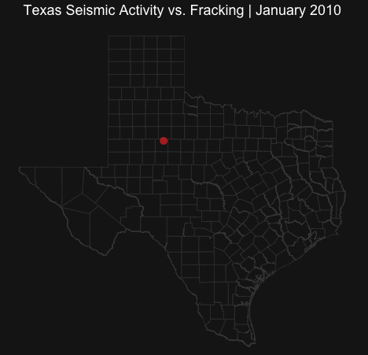

***Disclaimer:*** *This project visualizes the relationship between Unconventional Oil and Gas (UOG) activity and seismic events, but does not imply that production wells directly cause earthquakes. The primary driver of induced seismicity is wastewater disposal wells. However, because production and disposal are co-dependent processes, increased UOG extraction generates more wastewater, requiring more disposal, which ultimately elevates seismic risk.*
# Background and Motivation

Fossil fuels still dominate global energy systems, accounting for roughly 80% of global energy consumption and more than 80% of U.S. energy use [@css2025facts]. Over the past two decades, advances in horizontal drilling and hydraulic fracturing have enabled the large-scale development of unconventional oil and gas (UOG) resources trapped in low-permeability shale formations [@wang2015review]. Fracking involves the injection of high-pressure fluid (water, proppant/sand, biocides, surfactants, and gelling agents) into the shale, creating fractures that allow hydrocarbons to flow to the wellbore [@schultz2020hydra]. The result: from the early 2000s to 2012, U.S. gas production rose exponentially (\<1% to 40%) [@nicot2014source].

Environmental and geophysical concerns have risen accordingly. Fracking operations typically require millions of gallons of water per well [@jackson2015depths] and generate large volumes of saltwater brine that must be managed/disposed of, often through underground disposal wells [@gregory2011water; @chen2016water]. Some wastewater is recyled, or treated, but most of it is injected. Changes in subsurface fluid pressure associated with these processes can alter stress conditions along existing faults, potentially triggering induced seismicity [@ellsworth2013inject]. Aquifer contamination is another major concern, especially because hydraulic fracturing activities are exempt from Safe Drinking Water Act oversight via the 2005 "Halliburton Loophole" (*thanks Dick Cheney*) [@nicot2014source; @underhill2023outcome].

Since roughly 2008, earthquake activity has increased across parts of the central United States, with many events linked to wastewater disposal and other oil and gas activities [@walter2018natural]. In response to increasing seismicity and the need for improved monitoring (in other words it got so bad that the Texas legislature had to do something about it), Texas established the Texas Seismological Network (TexNet) to expand monitoring capabilities across the state [@savvaidis2019texnet]. Recent studies suggest that seismicity, particularly the Permian Basin, has increased dramatically in recent decades and is often associated with fluid injection at depth [@skoumal2021prolif].

This project explores the spatial and temporal relationship between UOG development and earthquake activity in Texas using FracFocus well data, USGS earthquake catalogs, and TexNet seismic records [@fracfocus_data; @usgs_texas_earthquakes; @texnet_data_portal].

# Methodology -- *Big Oil, Big data*

This project leverages multiple datasets describing both oil and gas activity and earthquake events in Texas, including:

Hydraulic fracturing disclosures from the FracFocus Chemical Disclosure Registry [@fracfocus_data]

Earthquake catalogs from the U.S. Geological Survey (USGS) [@usgs_texas_earthquakes]

Seismic monitoring data from the Texas Seismological Network (TexNet) [@texnet_data_portal]

FracFocus contains well-level records describing hydraulic fracturing operations, including injection volumes, well identifiers, location, chemical disclosures, and job start/end dates. Because the raw FracFocus dataset is highly untidy (understatement) and often contains multiple entries for a single operation, records were cleaned to sensible ranges, and aggregated by API well number and job end date. For each well, the final dataset retains total base water volume, total base non-water volume, total vertical depth, API number, as well as positioning and temporal data. I also construct a total volume measure to serve as a proxy for the intensity of a fracking job. The raw data is 7,060,962 rows (many rows per well for chemical disclosure purposes), after collapsing, filtering, and cleaning, I was left with 95,197 Texas wells from 9/5/2010 to 12/31/2024.

Earthquake data were obtained from the USGS Comprehensive Earthquake Catalog and supplemented with data from TexNet, a more thorough monitoring network [@savvaidis2019texnet]. There's a considerable difference in frequency prior to 2017, but this is a data artifact (not less earthquakes, but scarcer monitoring). The catalogs start to align around 2020/2021, I assume the USGS integrated the TexNet stations around then. For the sake of this project, I use USGS events prior to 2017, and TexNet events from 2017 onward.

After cleaning and standardizing these datasets, the analysis compares the spatial and temporal patterns of UOG operations and seismic events. Time-series plots and spatial maps are used explore these relationships, and well characteristics such as depth and injection volume will hopefully reveal some interesting patterns.

## Cleaning the FracFocus data

::: {style="text-align: center; margin-bottom: 10px;"}
*"Though FracFocus remains the most complete set of fracking data available, researchers and regulators have critiqued it as an ineffective vehicle for chemical disclosure and analysis because of its inaccessibility and inadequate quality control"* — @underhill2023outcome
:::

The FracFocus data is quite rich, but also horribly messy and large. Narrowing an area of interest cuts it down a bit; this can be done by filtering for the first two digits (42 for TX) of a well's American Petroleum Institute identifier (`APINumber` column), or filtering in `StateName` as a backup. This still wasn't perfect, so I clipped the wells that only fall within the Texas borders sf object. The data, by nature, is also very long, as it is intended to disclose chemicals and quantities put in the ground at different points in a well's operation span (though somehow it's legal to say *"trade secret"* or *"proprietary blend"*). For an analysis concerned with the chemical disclosures, good luck, but because I'm only concerned with well position and final injection volume, so I collapsed by `APINumber`, `JobEndDate`, and took the maxes of `TotalBaseWaterVolume`, `TotalBaseNonWaterVolume`, and `TVD` (depth) so that I'd hopefully be left with unique wells, their position, and an idea of final injection volume. That condensed the FracFocus data considerably, but there were still issues (year 3012, impossible depth and volume values), so I handled those by applying sensible mins and maxes, and trimming observations outside the 99th percentile. There are other, more exhaustive ways to handle the FracFocus data [see: @underhill2023outcome; @chen2016water; @allison2026openff].

```{r eval= FALSE, echo= TRUE}
library(data.table)
library(dplyr)
library(lubridate)

files <- paste0('data/FracFocusCSV/FracFocusRegistry_', 1:15, '.csv')

clean_and_collapse_frac <- function(file_path) {
  # function: reads a raw FracFocus CSV, filters for Texas wells, standardizes data types, 
  #     collapses the data by API Number and Job End Date, and removes impossible values
  # argument: file_path,  the file path to a fracfocus csv
  # output: a (hopefully) cleaned data frame of texas fracking well data
  
  df <- fread(file_path)
  df_clean <- df %>%
    mutate(
      APINumber = as.character(APINumber),
      StateName = toupper(StateName)
    ) %>%
    # filter using texas API numbers or state names incase there's errors
    filter(substr(APINumber, 1, 2) == '42' | StateName %in% c('TEXAS', 'TX')) %>%
    mutate(
      JobEndDate = as.Date(parse_date_time(JobEndDate, orders = c("mdy IM p", "mdy HMS", "ymd HMS", "mdy", "ymd"))), #makes sure the date formats are handled correctly
      TotalBaseWaterVolume = as.numeric(TotalBaseWaterVolume),
      TotalBaseNonWaterVolume = as.numeric(TotalBaseNonWaterVolume),
      TVD = as.numeric(TVD)
    ) %>%
    #collapse by API number and JobEndDate (to capture final injection volume)
    group_by(APINumber, JobEndDate) %>%
    summarize(
      Latitude= first(Latitude),
      Longitude= first(Longitude),
      TVD= max(TVD, na.rm = TRUE),
      TBWV= max(TotalBaseWaterVolume, na.rm = TRUE),
      TBNWV= max(TotalBaseNonWaterVolume, na.rm = TRUE),
      .groups= 'drop'
    ) %>%
    # remove the inf values that max() created for NA groups
    mutate(
      TVD= ifelse(is.infinite(TVD), NA, TVD),
      TBWV= ifelse(is.infinite(TBWV), NA, TBWV),
      TBNWV= ifelse(is.infinite(TBNWV), NA, TBNWV)
    ) %>%
    # create a total fluid volume column
    mutate(
      Total_Fluid_Volume= coalesce(TBWV, 0) + coalesce(TBNWV, 0),
      Total_Fluid_Volume= ifelse(is.na(TBWV) & is.na(TBNWV), NA, Total_Fluid_Volume)
    ) %>%
    # drop absurd values
    filter(
      TVD > 500 & TVD <= 25000, 
      Total_Fluid_Volume > 0 & Total_Fluid_Volume <= 100000000,
      JobEndDate >= as.Date('2010-01-01') & JobEndDate <= as.Date('2024-12-31')# drop absurd dates (somebody wrote year 3012 in the raw data)
    )
  return(df_clean)
}

# apply and bind
master_frac <- lapply(files, clean_and_collapse_frac) %>%
  bind_rows() %>%
  distinct(APINumber, JobEndDate, .keep_all = TRUE) 

# it still requires more cleaning, API and State Name didn't work perfectly
master_frac_patched <- master_frac %>%
  filter(
    # drop wells that aren't in texas
    Latitude >= 25.8 & Latitude <= 36.5,
    Longitude >= -106.6 & Longitude <= -93.5,
    # should be positive I think
    (TBNWV >= 0 | is.na(TBNWV))
  )

summary(master_frac_patched %>% select(Latitude, Longitude, TBNWV)) # nope not quite there yet

# hopefully the last bit of cleaning, because there's still some questionable values
tbwv_ceiling <- quantile(master_frac$TBWV, 0.99, na.rm= TRUE)
tbnwv_ceiling <- quantile(master_frac$TBNWV, 0.99, na.rm= TRUE)

master_frac_cleanest <- master_frac_patched %>%
  filter(
    TBWV <= tbwv_ceiling | is.na(TBWV),
    TBNWV <= tbnwv_ceiling | is.na(TBNWV),
    Total_Fluid_Volume > 0 )

summary(master_frac_cleanest %>% 
          select(TBWV, TBNWV, Total_Fluid_Volume))

# last thing since there's still some wells outside of TX

tx_boundary <- states(cb = TRUE, class = 'sf') %>%
  filter(STUSPS == 'TX') %>%
  st_transform(4326)

# convert wells to sf
wells_sf <- st_as_sf(
  master_frac_cleanest, 
  coords= c('Longitude', 'Latitude'), 
  crs= 4326,
  remove= FALSE)

wells_sf <- st_filter(wells_sf, tx_boundary)

master_frac_cleanest <- st_drop_geometry(wells_sf)

fwrite(master_frac_cleanest, 'data/master_frac_cleanest.csv') 
```

## Scraping the USGS data

This is like what we did in class, but it gets 15 years of low-magnitude earthquake data. A `for` loop builds a url to query for each year, adds that csv to an empty list, then binds those into the earthquake data for this project. Spatial bounding (a box around Texas), pausing bewteen requests (`Sys.sleep(1.5)`), and `GET()` error handling from the `httr` package ensure this script doesn't blow up. [@wickham2026httr; @ramy2021scrape]

```{r eval= FALSE, echo= TRUE}
# Abdallah, 2021's methodology was helpful here, adding yearly data to a blank list, ensuring the url returns a valid response
library(httr)
library(readr)
library(dplyr)
library(lubridate)

# make a box around texas, will clip with sf object later
min_lat <- 25.8
max_lat <- 36.5
min_lon <- -106.6
max_lon <- -93.5

# specifying years of interest
years <- 2010:2025

# empty list for each year's data
usgs_list <- list()

# loop to query the usgs API
for(y in years) {
  start_time <- paste0(y, "-01-01")
  end_time   <- paste0(y, "-12-31")
  # build the url
  url <- paste0(
    "https://earthquake.usgs.gov/fdsnws/event/1/query?",
    "format=csv",
    "&starttime=", start_time,
    "&endtime=", end_time,
    "&minlatitude=", min_lat,
    "&maxlatitude=", max_lat,
    "&minlongitude=", min_lon,
    "&maxlongitude=", max_lon
    # there is no minmagnitude bexause I want small earthquakes
  )
  Sys.sleep(1.5) #handles rate limiting
                      # the next few lines handle errors
  resp <- GET(url)
  if(status_code(resp) == 200) {
    yr_data <- read_csv(content(resp, "text", encoding = "UTF-8"), show_col_types = FALSE)
    usgs_list[[as.character(y)]] <- yr_data
  } else {
    warning(paste("failed at year", y, " status code: ", status_code(resp)))
  }
}

# bind usgs years together
usgs_raw <- bind_rows(usgs_list)

# reassign cols to match texnet
usgs_clean <- usgs_raw %>%
  select(
    Time= time,
    Latitude= latitude,
    Longitude= longitude,
    Depth_km= depth,
    Magnitude= mag,
    EventID= id
  ) %>%
  mutate(
    Time= as_datetime(Time), # make sure the time col works, as i will need it later
    Source= 'USGS' # adding this so it's clear what's usgs and what's texnet
  )

usgs_final <- usgs_clean %>%
  mutate(
    Date= as.Date(Time) # also fix the time column
  ) %>%
  filter(Date <= as.Date("2025-12-31")) %>%
  select(EventID, Date, Latitude, Longitude, Depth_km, Magnitude, Source)

library(sf)
library(tigris)
library(dplyr)

# just have to clip the usgs data from a big square to the actual texas borders

# tx state boundary
# get the texas polygon
tx_boundary <- states(cb = TRUE, class = 'sf') %>%
  filter(STUSPS == 'TX') %>%
  st_transform(4326)

# convert earthquakes to sf
quakes_sf <- st_as_sf(
  usgs_final, 
  coords= c('Longitude', 'Latitude'), 
  crs= 4326,
  remove= FALSE 
)

tx_quakes_sf <- st_filter(quakes_sf, tx_boundary)

usgs_final <- st_drop_geometry(tx_quakes_sf)

fwrite(usgs_final, 'data/usgs_final.csv')
usgs_final <- fread('data/usgs_final.csv')
```

## Binding the USGS data (2010-2017) to the TexNet data (2017--)

TexNet offers better monitoring and spatial coverage, but it didn't exist before 2017. Because I still wanted to observe early seismicity trends as fracking operations increased, I use USGS data to cover the 2010–2016 gap. From 2017 onward, this project strictly uses TexNet. While it seems the USGS has integrated TexNet’s stations recently, drawing a hard line in 2017 gives us the sharpest localized data possible, keeping the pre-2017 data scarcity in mind.

```{r eval= FALSE, echo= TRUE}
library(data.table)
library(dplyr)
library(lubridate)

texnet <- fread('data/texnet_events.csv')
#cut usgs once texnet starts (texnet has better detection)
usgs_final <- usgs_final %>%
  filter(Date <= as.Date("2016-12-31")) %>%
  select(EventID, Date, Latitude, Longitude, Depth_km, Magnitude, Source)

#  prep texnet data, just harmonizing col names
texnet_final <- texnet %>%
  mutate(
    Date= as.Date(`Origin Date`),
    Source= 'TexNet',
    Magnitude= coalesce(`Local Magnitude`, `Moment Magnitude`) # merge the two magnitude columns
  ) %>%
  filter(Date >= as.Date("2017-01-01")) %>%
  select(
    EventID,
    Date,
    Latitude= `Latitude (WGS84)`,
    Longitude= `Longitude (WGS84)`,
    Depth_km= `Depth of Hypocenter (Km. Rel to Ground Surface)`, #  ground surface depth to match USGS standards
    Magnitude,
    Source
  )
fwrite(texnet_final, 'data/texnet_final.csv')
# bind usgs and texnet

master_earthquakes <- bind_rows(usgs_final, texnet_final) %>%
  filter(!is.na(Latitude) & !is.na(Longitude) & !is.na(Magnitude)) %>%
  arrange(Date) 

fwrite(master_earthquakes, 'data/master_earthquakes.csv')

#summary(master_earthquakes)
```

```{r eval= FALSE, echo= FALSE}
#nonessential codeblock
library(sf)
library(tigris)
library(dplyr)

# tx state boundary
# get the texas polygon
tx_boundary <- states(cb = TRUE, class = 'sf') %>%
  filter(STUSPS == 'TX') %>%
  st_transform(4326)

# convert earthquakes to sf
quakes_sf <- st_as_sf(
  master_earthquakes, 
  coords = c('Longitude', 'Latitude'), 
  crs = 4326,
  remove = FALSE 
)

tx_quakes_sf <- st_filter(quakes_sf, tx_boundary)

master_earthquakes_tx <- st_drop_geometry(tx_quakes_sf)

fwrite(master_earthquakes_tx, 'data/master_earthquakes_tx.csv')
```

# Analysis

## Checking USGS/TexNet Coverage and Examining Earthquake Frequency Trends

Understanding earthquake detection capabilities prior to TexNet is essential for this project. The daily frequency timeline shows seismic activity around the beginning of the Shale Boom to the present. While the pre-2017 timeline shows a seemingly negligible amount of earthquakes, this is entirely a monitoring artifact. By 2015, induced seismicity had become such a big issue that Texas mandated a massive upgrade to its seismic infrastructure. The accompanying map of TexNet's monitoring stations shows the result of that initiative (stations are all across the state now).

```{r eval= TRUE, echo= TRUE, warning= FALSE, message= FALSE}
library(dplyr)
library(ggplot2)
library(data.table)
usgs_final <- fread('data/usgs_final.csv')
texnet_final<- fread('data/texnet_final.csv')

usgs_counts <- usgs_final %>%
  count(Date) %>%
  mutate(source = 'USGS')

texnet_counts <- texnet_final %>%
  count(Date) %>%
  mutate(source= 'TexNet')

combined_counts <- bind_rows(usgs_counts, texnet_counts)

eq_cov <- ggplot(combined_counts, aes(x= Date, y= n, color= source)) +
  # raw daily counts
  geom_line(linewidth = 0.4, alpha = 0.5) +
  # smoothed trend
  geom_smooth(aes(linetype= source),
              method= 'loess',
              se= FALSE,
              linewidth= 1.1,
              alpha= .5)+
  # TexNet deployment marker
  geom_vline(xintercept= as.Date("2017-01-01"),
             linetype= 'dashed',
             color= '#e4e3e3',
             linewidth= 0.7) +
  annotate('text',
           x= as.Date('2017-01-01'),
           y= 50,
           label= 'TexNet deployment',
           angle= 90,
           vjust= -.5,
           size= 3.5,
           color= '#e4e3e3') +
  
  scale_color_manual(values = c(
    'USGS' = '#00BFFF',
    'TexNet' = '#FF2400'))+
 
   scale_linetype_manual(values= c(
    'USGS' = "solid",
    'TexNet' = "solid" ))+
 
   labs(
    x= 'Year',
    y= 'Number of Earthquakes (daily)',
    color= 'Catalog',
    linetype= 'Catalog')+
  
  theme_minimal() +
  theme(
    plot.background= element_rect(fill= '#151515', color= NA),
    panel.background= element_rect(fill= '#151515', color= NA),
    legend.background= element_rect(fill= '#151515', color= NA),
    legend.key= element_blank(),
    
    text= element_text(color= '#e4e3e3'),
    axis.text= element_text(color= '#e4e3e3'),
    panel.grid.major= element_line(color= '#313131', linewidth= 0.2),
    panel.grid.minor= element_blank(),
    legend.position= c(0.02, 0.98),
    legend.justification= c(0, 1))+
  ylim(0,100) #scaling looked bad so the rare days are not shown
```

::: {.column-screen layout-ncol="2"}
### Event Frequency and Monitoring Coverage

```{r}
#| warning: false
#| message: false
#| echo: false

eq_cov
```

### TexNet Monitoring Stations

 [@texnet_fig] Now, TexNet has portable and permanent monitoring stations all across the state with the capacity to detect and analyze earthquakes with greater accuracy
:::

```{r message= FALSE, echo= FALSE, warning= FALSE}
#| results: hide
library(sf)
library(tigris)
library(leaflet)
library(dplyr)
library(data.table)

master_frac_cleanest <- fread('data/master_frac_cleanest.csv')
master_earthquakes <- fread('data/master_earthquakes.csv')
#add texas counties
tx_counties <- counties(state= 'TX', cb= TRUE, class= 'sf')
tx_counties <- st_transform(tx_counties, 4326)
```

## Hexbin density plots

By aggregating \~95,000 production wells and \~45,000 earthquakes into spatial hexbins, we can see the spatial patterns of induced seismicity in Texas. The highest concentrations of modern seismic activity map directly onto the state's most active UOG regions. The Permian and Delaware Basins burn the brightest on both maps. Massive production requires massive wastewater disposal, triggering heavy seismic clusters.

```{r}
#| results: hide
# bounds because whitespace was tarnishing my custom theme
 bbox <- sf::st_bbox(tx_counties)
 
 coord_sf(
   xlim= c(bbox['xmin'], bbox['xmax']),
   ylim= c(bbox['ymin'], bbox['ymax']),
   expand= FALSE
)
# this didnt even end up working

eq_hex <- ggplot() +
  geom_sf(data= tx_counties, fill= NA, color= 'grey60', linewidth= 0.3)+
  geom_hex(data= master_earthquakes, aes(x= Longitude, y= Latitude), bins= 40)+
  scale_fill_viridis_c(option= 'plasma', 
                       name= 'Earthquake Count',
                       guide= guide_colorbar(
                      barheight= unit(60, 'pt'),
                       barwidth= unit(8, 'pt'))
                      )+
  coord_sf(
  xlim= c(bbox['xmin'], bbox['xmax']),
  ylim= c(bbox['ymin'], bbox['ymax']),
  expand= FALSE)+
  theme_void()+
  theme(
    plot.background= element_rect(fill = '#151515', color = NA),
    panel.background= element_rect(fill = '#151515', color = NA),
    legend.background= element_rect(fill = '#151515', color = NA),
    legend.position= c(0.98, 0.98),
    legend.justification= c(1, 1),
    legend.key= element_blank(),
    plot.margin= margin(0,0,0,0),
    text= element_text(color= '#e4e3e3'),
    axis.text= element_text(color = '#e4e3e3'),
    panel.grid.major = element_line(color = '#313131', linewidth = 0.2),
    panel.grid.minor = element_blank()
  )

#eq_hex

frac_hex <- ggplot() +
  geom_sf(data = tx_counties, fill = NA, color = 'grey60', linewidth = 0.3)+
  geom_hex(data = master_frac_cleanest, aes(x = Longitude, y = Latitude), bins = 40)+
  scale_fill_viridis_c(option= 'plasma', 
                       name= 'Well Count',
                       guide= guide_colorbar(
                      barheight= unit(60, 'pt'),
                       barwidth= unit(8, 'pt'))) +
    coord_sf(
    xlim= c(bbox['xmin'], bbox['xmax']), # yea didn't end up trimming whitespace, i ended up just guessing fig-width till it worked
    ylim= c(bbox['ymin'], bbox['ymax']),
    expand= FALSE) +
  theme_void() +
  theme(
    plot.background= element_rect(fill = '#151515', color = NA),
    panel.background= element_rect(fill = '#151515', color = NA),
    legend.background= element_rect(fill = '#151515', color = NA),
    legend.position= c(0.98, 0.98),
    legend.justification= c(1, 1),
    legend.key= element_blank(),
    plot.margin= margin(0,0,0,0),
    text= element_text(color= '#e4e3e3'),
    axis.text= element_text(color = '#e4e3e3'),
    panel.grid.major = element_line(color = '#313131', linewidth = 0.2),
    panel.grid.minor = element_blank()
  )
#frac_hex
```

::::: {.column-screen layout-ncol="2"}
::: column
### Density of Fracking Operations

```{r}
#| echo: false
#| fig-width: 9
#| fig-height: 8.36
#| fig-background: transparent
#| out-width: "100%"

frac_hex
```
:::

::: column
### Density of Seismic Events

```{r}
#| echo: false
#| fig-width: 9
#| fig-height: 8.36
#| fig-background: transparent
#| out-width: "100%"

eq_hex
```
:::
:::::

## Spatial & Temporal Mapping

The interactive map and animated timeline below show the geographic distribution of \~140,000 combined data points. Seismic Events (Red), are scaled and colored by magnitude. Production Wells (Blue) are scaled and colored by total fluid injection volume, serving as a proxy for the intensity of the extraction operation. It's interesting to pan across the major basins, zoom in to see patterns, and use the timeline to watch how the exponential expansion of UOG activites overlays with the increase in seismicity.

```{r echo= FALSE, message= FALSE, warning= FALSE}
# ignore this
library(sf)
library(tigris)
library(leaflet)
library(dplyr)
library(data.table)
master_frac_cleanest <- fread('data/master_frac_cleanest.csv')
#wells map
wells_map <- leaflet(options= leafletOptions(preferCanvas = TRUE)) %>%
  addProviderTiles(providers$CartoDB.Positron) %>%
  addPolygons(
    data= tx_counties,
    fillColor= "lightgrey",
    color= 'black',
    weight= 1,
    fillOpacity= 0.2
  ) %>%
  addCircleMarkers(
    data= master_frac_cleanest,
    lng= ~Longitude,
    lat= ~Latitude,
    radius= 3,
    color= 'steelblue',
    stroke= FALSE,
    fillOpacity= 0.6,
  )

#wells_map
```

```{r echo= FALSE, message= FALSE, warning= FALSE}
# ignore this
# earthquakes map

master_earthquakes <- fread('data/master_earthquakes.csv')

quakes_map <- leaflet(options = leafletOptions(preferCanvas = TRUE)) %>%
  addProviderTiles(providers$CartoDB.Positron) %>%
  addPolygons(
    data = tx_counties,
    fillColor = 'lightgrey',
    color = 'black',
    weight = 1,
    fillOpacity = 0.2
  ) %>%
  addCircleMarkers(
    data = master_earthquakes,
    lng = ~Longitude,
    lat = ~Latitude,
    radius = 3,
    color = 'firebrick', 
    stroke = FALSE,
    fillOpacity = 0.6,
  )

#quakes_map
```

```{r}
#| echo: false
#| eval: false
#| warning: false
#| message: false
# ignore this, i didnt end up using these
# display the two leaflet graphs side by side
library(leafsync)
sync(wells_map, quakes_map)
```

```{r warning= FALSE, message= FALSE}
# This chunk of code produces the Leaflet map


col_mag <- colorNumeric('Reds', master_earthquakes$Magnitude)
col_vol <- colorNumeric('Blues', master_frac_cleanest$Total_Fluid_Volume)

wq <- leaflet(options = leafletOptions(preferCanvas= TRUE)) %>% #drastically improves performance
  addProviderTiles(providers$CartoDB.DarkMatter) %>% # contrast helps seeing points
  addPolygons(
    data = tx_counties,
    fillColor = 'transparent', 
    color = '#444444',        
    weight = 1
  ) %>%
  
  # wells are plotted first
  addCircleMarkers(
    data= master_frac_cleanest,
    lng= ~Longitude,
    lat= ~Latitude,
    radius= ~(sqrt(Total_Fluid_Volume) / 500) + 1, # this needed special handling because of the range
    color= ~col_vol(Total_Fluid_Volume),   
    stroke= FALSE,
    fillOpacity= 0.15, 
    group= 'Fracking Wells'
  ) %>%
  # earthquakes sit on top
  addCircleMarkers(
    data= master_earthquakes,
    lng= ~Longitude,
    lat= ~Latitude,
    radius= ~Magnitude *2.5,
    color= ~col_mag(Magnitude),   
    stroke= FALSE,
    fillOpacity= 0.5,  
    group = 'Earthquakes'
  ) %>%
  
  addLayersControl(
    overlayGroups = c('Fracking Wells', 'Earthquakes'),
    options = layersControlOptions(collapsed = FALSE)
  )

#wq
```

```{r eval= FALSE, warning= FALSE, message= FALSE}
# this code produces the animated map
library(ggplot2)
library(gganimate)
library(dplyr)
 col_mag <- colorNumeric('Reds', master_earthquakes$Magnitude)
 col_vol <- colorNumeric('Blues', master_frac_cleanest$Total_Fluid_Volume)
# prep fracfocus data
frac_anim <- master_frac_cleanest %>%
  mutate(
    Anim_Date = as.Date(JobEndDate), # make this match quakes
    p_size = (sqrt(Total_Fluid_Volume) / 1000) + 0.1,
    p_color = col_vol(Total_Fluid_Volume)
  ) %>%
  filter(!is.na(Anim_Date))

# prep eq data
eq_anim <- master_earthquakes %>%
  mutate(
    Anim_Date = as.Date(Date),
    p_size = ifelse(Magnitude <= 0, 0.1, Magnitude * 1.5), #don't want negative or 0 mag
    p_color = col_mag(Magnitude)
    ) %>%
  filter(!is.na(Anim_Date))
# Build the static map first
anim_plot <- ggplot() +
  geom_sf(data= tx_counties, fill= '#1A1A1A', color= '#444444', linewidth = 0.3) +
  
  geom_point(
    data= frac_anim,
    aes(x= Longitude, y= Latitude, size= p_size, color= p_color), 
    alpha= 0.15, stroke= 0
  ) +
  
  geom_point(
    data= eq_anim,
    aes(x= Longitude, y= Latitude, size= p_size, color= p_color), 
    alpha= 0.7, stroke= 0
  ) +
  
  scale_size_identity()+
  scale_color_identity()+
  
  theme_void() +
  theme(
    plot.background= element_rect(fill= '#1A1A1A', color= NA),
    plot.title= element_text(color= 'white', size= 18, face= 'bold', hjust= 0.5),
    plot.margin= margin(10, 10, 10, 10)
  ) +
  

  transition_time(Anim_Date)+

  shadow_mark(past = TRUE, future = FALSE)+ # this is so the points stay

  labs(title= "Texas Seismic Activity vs. Fracking | {format(frame_time, '%B %Y')}")

animate(
  anim_plot, 
  nframes= 300,       
  fps= 15,            
  width= 800,         
  height= 800,        
  renderer= gifski_renderer() 
)

# I did a little bit of cropping outside R, there was white space. then i just load it from the /figures folder
```

::::: {.column-screen layout="[60, 40]"}
::: column
### Interactive Map: Total Injection Volume and Events

```{r}
#| echo: false
#| message: false
#| warning: false

wq
```
:::

::: column
### Timeline


:::
:::::

## Time Trends and the Depth Disconnect

The figure on the left plots monthly fluid injection volumes (scaled for visibility) against the monthly count of seismic events. The temporal trends track closely: as injection volume increases, seismic event frequency often rises as well (or falls if you look at 2020).

However, the density plot on the right reveals an important geophysical feature. When comparing the True Vertical Depth (TVD) of production wells against the focal depth of the earthquakes, there is very little overlap. Seismic events are occurring significantly deeper in the subsurface than the depth of the production wells. The production wells themselves are not physically triggering the deep faults. Instead, the massive volumes of wastewater they generate are disposed of in separate, much deeper injection wells (often nearby), which alter pressures in the underlying crystalline basement rock, triggering deep slips.

```{r message= FALSE}
frac_month <- master_frac_cleanest %>%
  mutate(month = as.Date(cut(JobEndDate, 'month'))) %>%
  group_by(month) %>%
  summarise(total_volume = sum(Total_Fluid_Volume, na.rm=TRUE))

quake_month <- master_earthquakes %>%
  mutate(month= as.Date(cut(Date, 'month'))) %>%
  count(month)

combined <- left_join(frac_month, quake_month)

p1<- ggplot(combined, aes(x = month)) +
  geom_line(aes(y= n), color= '#FF2400', linewidth= 1) +
  #FF4500
  geom_line(aes(y= total_volume/1e7), color= '#00BFFF', linewidth= 1) +
  
  labs(
    title= 'Monthly Production Well Injection Volume and Event Frequency',
    x= 'Year',
    y= 'Scaled Values')+
  
  theme_minimal()+
  theme(
    plot.background= element_rect(fill= '#151515', color= NA),
    panel.background= element_rect(fill= '#151515', color= NA),
    legend.background= element_rect(fill= '#151515', color= NA),
    legend.key= element_blank(),
    text= element_text(color= '#e4e3e3'),
    axis.text= element_text(color= '#e4e3e3'),
    panel.grid.major= element_line(color= '#313131', linewidth= 0.2),
    panel.grid.minor= element_blank()
  )
#p1
```

```{r}
# density plots
master_frac_cleanest <- fread('data/master_frac_cleanest.csv')
master_earthquakes <- fread('data/master_earthquakes.csv')
master_earthquakes <- master_earthquakes %>% 
  mutate(Depth_ft= round(Depth_km * 3280.84, 1)) # making sure they match


pdf1<- ggplot() +
  geom_density(data = master_frac_cleanest, 
               aes(x = TVD, fill = 'Wells'),  
               alpha = 0.6, 
               color = NA) + 
  
  geom_density(data = master_earthquakes, 
               aes(x = Depth_ft, fill = 'Earthquakes'), 
               alpha = 0.5, 
               color = NA) +
  
  scale_fill_manual(
    name = 'Legend',
    values = c("Wells" = '#00BFFF', 'Earthquakes' = '#FF2400')
  ) +
  
  labs(
    title= "Depth Distribution: Production Wells vs. Seismic Events",
    x= 'Depth (Feet)',
    y= 'Density')+
  
  xlim(0, 4e4)+ # it was getting too stretched out
  
  theme_minimal()+
  theme(
    plot.background= element_rect(fill= '#151515', color= NA),
    panel.background= element_rect(fill= '#151515', color= NA),
    legend.background= element_rect(fill= '#151515', color= NA),
    legend.key= element_blank(),
    text= element_text(color= '#e4e3e3'),
    axis.text= element_text(color= '#e4e3e3'),
    panel.grid.major= element_line(color= '#313131', linewidth= 0.2),
    panel.grid.minor= element_blank(),
    
    legend.position= c(0.98, 0.98), # making sure the legend stays put
    legend.justification = c(1, 1) 
  )
```

::::: {.column-screen layout="[48, 48]"}
::: column
### Monthly Injection Volume, Monthly Events

```{r}
#| echo: false
#| message: false
#| warning: false

p1
```
:::

::: column
### Distribution of TVD and Event Depth

```{r}
#| echo: false
#| message: false
#| warning: false

pdf1
```
:::
:::::

::: column-screen
## Groundwater Concerns and Geology

For those curious about the risk to local aquifers, I also include a figure from The @twdb2026. It maps groundwater wells across Texas, and you can also toggle geological layers and see well purpose (domestic, irrigation, commercial, and livestock). I was curious so see if many domestic water wells reach depths that are vulnerable to fracking fluid migration. TVD is only part of the risk, even if a domestic well is safely situated far above a fracturing zone, the groundwater is still susceptible to contamination through mechanical and logistical failures. Poorly cemented well casings, surface-level wastewater spills, and transport tanker/storage leaks present shallow-depth risks to local water supplies.

<iframe src="https://www3.twdb.texas.gov/apps/waterdatainteractive/groundwaterdataviewer/?embed=true" style="width: 100%; height: 600px;" scrolling="no" frameborder="0">

</iframe>

*Source: Texas Water Development Board — Water data Interactive* [@twdb2026]
:::

```{r echo= FALSE, eval= FALSE}
## Cumulative Distribution of TX Earthquakes
# saw a paper that made these, but i didnt end up including.
master_earthquakes %>%
  arrange(Date) %>%
  mutate(cum_eq = row_number()) %>%
  ggplot(aes(Date, cum_eq)) +
  
  geom_line(color='#FF2400', linewidth = 1) +
  
  labs(
    title= 'Cumulative Earthquakes Over Time',
    x= 'Date',
    y= 'Total Earthquakes')+
  
  theme_minimal()+
  theme(
    plot.background= element_rect(fill= '#151515', color= NA),
    panel.background= element_rect(fill= '#151515', color= NA),
    text= element_text(color = '#e4e3e3'),
    axis.text= element_text(color= '#e4e3e3'),
    panel.grid.major= element_line(color= '#313131', linewidth= 0.2),
    panel.grid.minor= element_blank()
  )
```

::: column-screen
## Disposal Wells

The figure below from The Texas Tribune [@murphy2013disposal] shows the locations of wastewater disposal wells across the state. Although this specific snapshot reflects the infrastructure as of 2013, it shows that the disposal wells are built extremely close to to active production zones. Where there is intense UOG production, there must be high-volume wastewater disposal, inevitably resulting in a concentrated area of seismic activity.

<iframe src="https://apps.texastribune.org/series/water-for-fracking/map/?embed=true" style="width: 100%; height: 600px;" scrolling="no" frameborder="0">

</iframe>

*Source: Texas Tribune — Texas Disposal Wells* [@murphy2013disposal]
:::

# Further Study

This project lays the groundwork for two major extensions. A more thorough assessment of the specific chemicals used in UOG injection fluids would be a really nice route (many recent studies investigate this). Given the difficult nature of the FracFocus data, utilizing dedicated tools like the Open-FF project [@allison2026openff] would be very helpful.

The second extension is moving from visual correlation to statistical prediction (a task that requires dedicated geophysical and statistical expertise). While beyond the current scope of this project (and my abilities), advanced spatiotemporal modeling could be used to predict the frequency of events based on injection volumes, fluid density, or local geology. Transitioning from spatial mapping to predictive risk modeling would be super interesting, and maybe make UOG activities a bit safer.

<a class="btn btn-primary" 
   href="https://raw.githubusercontent.com/diloaaron/diloaaron.github.io/main/frackin.qmd" 
   download> download this .qmd file </a>

# References
